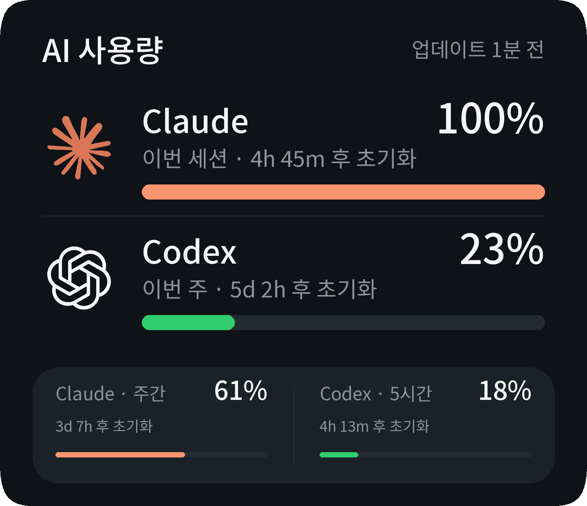

# AI Usage — 3×2 KWGT widget

[Download Quota Panel R7](AI_Usage_OneUI_3x2_R7.kwgt)

An editable, dark Korean-language widget for AI Usage Monitor. It has compact
Claude session and Codex weekly rows, plus a bottom panel for Claude weekly and
Codex five-hour quotas. Native vector marks and bundled Noto Sans KR fonts avoid
runtime image downloads. The background uses squircle-style corners.

**Experimental:** offline archive, layout, and formula tests pass. The operator
confirmed the container and widget work on Android on 2026-09-10. Device/version
coverage and long-running background refresh remain unverified.
See [verification boundaries](../../docs/widget-verification.md).



## Phone setup

1. Deploy the backend using the [root README](../../README.md). It must be
   reachable from the phone over private HTTPS. The preset does not host a server.
2. Install KWGT with custom-preset import support. Place a KWGT widget on the
   home screen and resize its launcher container to **3 columns × 2 rows**.
3. Save the `.kwgt` download to the phone's Downloads folder. Use KWGT's Import
   picker, select it, then load **AI 사용량 — Quota Panel 3x2 R7** from the library.
4. At the editor's **root**, open **Globals** (not the card's item settings).
   Set `server` and `token` below. New imports always start with blank settings.
5. Keep both root and card Layer Scale at **100**. Save, return to the home
   screen, and tap the applied widget. If using Tailscale, connect the phone first.

| Global | Value |
|---|---|
| `server` | Final HTTPS origin, e.g. `https://homelab.example.ts.net` |
| `token` | Contents of your backend's `secrets/widget-api-token` |

Do not add `/api/v1/usage/compact`, a query string, or credentials to `server`.
A trailing slash is accepted. The token uses letters, digits, `.`, `_`, `~`, or
`-`, and at least 16 characters; the backend's generated token qualifies. Never
use a Claude or Codex access token here. Leave derived/cache globals alone.
R7 uses a fixed dark palette, not an automatic light/dark theme.

Launcher padding and cell proportions vary. The card fills the viewport KWGT
provides, but it cannot remove margins imposed outside that viewport by a launcher.

## Fetching and display

- A built-in Flow performs a cached `GET /api/v1/usage/compact` on load, tap,
  and a ten-minute schedule. Tasker is not required. Taps are throttled to one
  attempt per 15 seconds; Android can delay background work.
- Authentication is in the bearer header, never the URL; TLS validation stays on.
  A tap does not force a provider poll. The backend collects independently.
- A successful HTTP 200 with recognized provider statuses is required before
  replacing cached JSON. Failures retain the last data. Changing the server
  hides data from the old server until a successful fetch.
- The API reports **remaining** quota; this widget converts it to **used**
  percentages and bars. Missing values show dashes, not zero. Reset labels are
  time-until-reset snapshots from the last fetch, not consumed subscription hours.
- Header states distinguish setup, syncing, offline, stale, and updated cache.
  A recent fetch does not prove a recent provider collection. Provider failures
  and stale data remain indicated.

## Troubleshooting

- **File not found:** import the actual downloaded file through KWGT's picker;
  do not reopen an obsolete preset entry or rename a non-widget download.
- **Setup / tap to sync:** check root Globals, save, connect private networking,
  then tap the applied widget. Check the Flow's test log if the state does not
  advance. Never share a log that contains the authorization header.
- **Offline / no data:** verify the server is running, HTTPS works without a
  redirect or invalid certificate, and the widget token is correct. Inspect
  provider status on the backend; expired provider snapshots need re-exporting.
- **Preview works, home screen does not:** inspect the applied widget, not the
  library thumbnail (which contains illustrative numbers). Confirm the correct
  preset is saved to that widget instance and check KWGT background permissions.
- **Missing logos:** R7 replaces the older PNG file references with embedded
  paths. If the issue recurs, report KWGT version and an
  applied-widget screenshot, without showing the token.

## Privacy and licensing

The distributed preset has blank server/token globals and no real usage cache.
Once configured, **your KWGT exports, backups, and debug logs are sensitive**.
The widget token also grants history access and manual refresh on the backend;
it is not read-only scoped. Rotate it after exposure. See [SECURITY.md](../../SECURITY.md).

Provider marks are MIT-licensed LobeHub assets; fonts use SIL OFL 1.1. Their
licenses travel inside the preset. See [asset attribution](assets/ATTRIBUTION.md).
This project is not affiliated with Anthropic, OpenAI, Samsung, or Kustom.

## Build and test

```bash
uv run --frozen python widgets/kwgt/build_widget.py
uv run --frozen pytest tests/test_kwgt_widget.py
uv run --frozen python scripts/check_publication.py
```

The default command builds R7 using only the standard library and bundled assets.
ZIP metadata is deterministic. Legacy factory functions remain for regression
tests, but obsolete downloads and previews are not distributed.

To regenerate R7's reference previews (build-only dependencies; no APK needed):

```bash
uv run --isolated --no-project --with pillow --with fonttools --with aggdraw \
  python widgets/kwgt/render_preview.py
```

These renders evaluate exported geometry/formulas locally; they are not Android
screenshots and the evaluator is not the proprietary KWGT runtime.

## Upstream references

- [Kustom importing help](https://docs.kustom.rocks/docs/faq/faq_kwgt/)
- [Kustom Flows](https://docs.kustom.rocks/docs/reference/flows/)
- [Official KWGT downloads](https://docs.kustom.rocks/docs/downloads/download-kwgt/)
- [Tailscale Serve](https://tailscale.com/docs/reference/tailscale-cli/serve)
